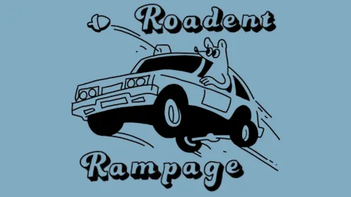

# Roadent Rampage

Watch the official trailer above.

Buckle up for **Roadent Rampage**, a groundbreaking 3-D driving adventure that
breaks consumer conventions and challenges manipulative marketing! Teamwork is
paramount as the audacious squirrels, **Bertram** and **Russel**, work in tandem to
steal the newest and coolest performance Hatchback model from the Convention
Dealership.

Together, navigate the treacherous terrain of consumer waste while
evading the relentless pursuit of the wrathful wavy man. Roadent Rampage
seamlessly integrates thrilling driving mechanics, intense cooperative
gameplay, and a thought-provoking narrative that sheds light on the impact of
consumerism on the environment.

Recognizing the influential role of media consumption on consumer habits, our
team aims to redefine the boundaries of gaming by inspiring players to make
conscientious choices as responsible consumers.

Get ready for a cohesive blend of excitement, collaboration, and
environmental consciousness that will captivate and empower players like never
before.

## The Making Of

Our team of seven created Roadent Rampage for an annual state-wide competition.
Out of 50 teams, our game won the award for the best game made by a team who
has never competed before!

The game took us about half of a year to make, complete with original models,
code, and music!

### Gameplay

Since the theme of the competition was "breaking conventions", we decided to
not only break conventions in our story, but also in our gameplay.

In our game, one player controls the steering of the car, and the other
manipulates the acceleration. Additionally, the acceleration player aims the gun
on the car, while the steering one shoots it.

The game is a blast to play, and we're truly proud of what we made.
